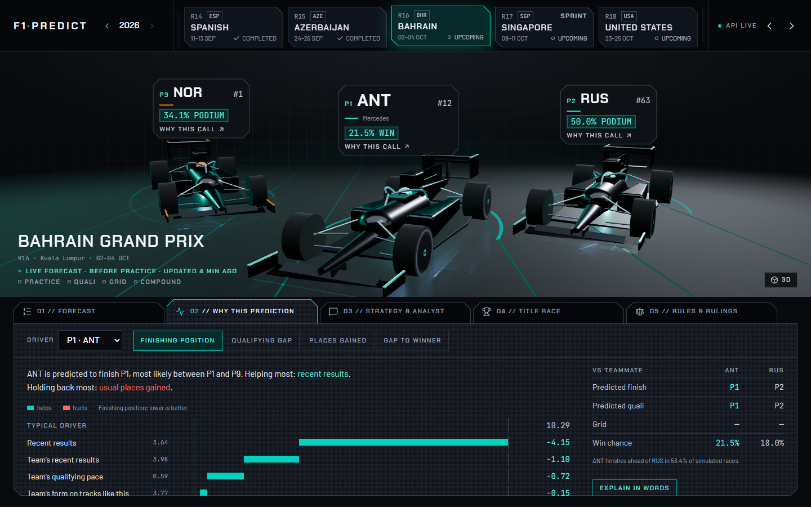

# F1 Predict

**Forecasts every Formula 1 race weekend, explains why, and shows how accurate it has really been.**



## What it does

For the next race, and for every race since 2022, the app shows:

| Question | What you see |
|---|---|
| Who will be on pole? | Predicted qualifying order and lap times, with each driver's chance of pole, of reaching Q3, and of going out in Q1 |
| Who will win? | Predicted finishing order, chances to win / finish on the podium / score points, a likely finishing range, retirement risk, and gap to the winner |
| Why? | The inputs that pushed each prediction up or down (recent results, grid slot, practice pace, circuit, weather forecast...), in plain words, plus a written explanation |
| What's the best strategy? | The fastest tyre plans, pit windows, and what a safety car on a given lap changes |
| Who wins the title? | Live standings with each driver's and team's chance of the championship |
| Anything else? | An analyst chat that answers from the app's own numbers and cites the FIA rules it uses |
| Can I trust it? | For every past race: what it predicted beforehand next to what happened, and its average error against simple guesses |

Forecasts refresh automatically through the weekend, getting sharper after each practice session and after qualifying.

## How it works

```
FastF1 (timing data) --+
Open-Meteo (forecasts) +--> per-race tables --> features --> 4 XGBoost models --+--> odds, ranges, lap times, race length
Jolpica (standings) ---+    (form, team, circuit,           (qualifying,       |--> strategy simulator (fitted on real stints)
                            practice, grid, weather)         finish, places     |--> championship simulation
                                                             gained, gap)       v
                             GitHub Actions: refresh every 30 min on race weekends,   JSON in data/predictions/
                             retrain weekly (only if the models still beat their      |
                             baselines)                                               v
                                                              FastAPI on Vercel --> React app
                                                              + local analyst (LangGraph router, 15 intents, 13 deterministic)
```

1. **Data.** One row per driver per race since 2022: grid, qualifying and practice times, the race-start weather forecast, result, gap to the winner, plus lap-by-lap tyre stints.
2. **Features.** Each driver's recent form, their history at this circuit, the team's form and pace, the teammate comparison and the circuit's characteristics. Every one is computed only from earlier races, so nothing leaks from the future.
3. **Four models, one per question.** XGBoost gradient-boosted trees for qualifying gap, finishing position, places gained and gap to the winner. Each serves every weekend stage: it was trained on copies of past races with the not-yet-known information hidden.
4. **Derived outputs.**
   - Odds and ranges come from simulating each race 10,000 times around the model's order.
   - Lap times and race length come from circuit history.
   - Strategy comes from a tyre-wear model fitted on real stints.
5. **Explanations.** SHAP values show how much each input moved each prediction. The chat is deterministic-first: a LangGraph router matches a question to one of 15 intents by keyword, 13 of them a pure data lookup and renders the answer from the real result -- no LLM chooses a tool or computes a number, so there's nothing for a model to get wrong on any of those. Only two things ("why is this predicted?" and anything unmatched) hand the already-computed numbers to a local, LoRA-fine-tuned Llama 3.2 1B to turn into prose, and both cite the regulation articles they ground on. See [docs/MODELS.md](docs/MODELS.md) and [AGENTS.md](AGENTS.md) for why: a 1B model fine-tuned on a consumer GPU can write a good paragraph around numbers it's handed, but can't be trusted to choose which numbers to fetch or compute them correctly itself.

## Accuracy

Measured on the latest 43 races (Nov 2024 to Sep 2026). Each was predicted by a model trained only on earlier races, the way a live forecast is.

| Prediction | After qualifying | Simple guess |
|---|---|---|
| Finishing position | off by **3.26** places on average | 3.43 (finish where you start) |
| Qualifying gap (after practice) | **0.64%** of a lap (~0.6 s) | 0.70% (team's usual gap) |
| Gap to winner | **0.64%** of race time (~35 s) | 0.85% |
| Win odds (Brier, lower is better) | **0.033** | 0.047 (everyone equal) |

The full model cards, including where the models are weak, are in [docs/MODELS.md](docs/MODELS.md).

## Run it locally

Requires Python 3.12+ and Node 24.

```bash
python -m venv .venv
.venv/Scripts/pip install -r requirements-dev.txt     # macOS/Linux: .venv/bin/pip
.venv/Scripts/python -m uvicorn src.api.main:app --reload

cd frontend && npm ci && npm run dev                  # http://localhost:5173
```

That's it -- no API key needed anywhere, and every chat intent except "why is this predicted?" and open-ended questions already works. For those two to answer in written prose instead of a plain data list, also install the local model (needs an NVIDIA GPU, 4-bit inference fits in ~4GB VRAM):

```bash
.venv/Scripts/pip install -r requirements-llm.txt
```

No restart wiring needed -- the backend detects it automatically (`src/rag/llm.py`'s `is_available()`).

| Task | Command |
|---|---|
| Forecast the next race now | `python -m src.models.refresh_job` |
| Ingest newly finished races | `python -m src.data.ingest --seasons 2026` |
| Rebuild the feature table | `python -m src.features.build_dataset` |
| Retrain and evaluate all four models | `python -m src.models.train` (about 10 min) |
| Refit odds, history view, strategy | `python -m src.models.probabilities`, `python -m src.models.backtest_export`, `python -m src.strategy.model` |
| Rebuild the regulations index | `python -m src.rag.corpus` |
| Chat in the terminal | `python -m src.agent.cli` |
| Tests | `python -m src.features.build_dataset` once, then `pytest`; `npm run lint && npm run build` in `frontend/` |

## Deploying

The API needs no model, no API key, and no GPU to serve 13 of the chat's 15 intents plus every other route -- only `explain_prediction`'s prose and the `general` catch-all need the local model, and both degrade to a plain data answer when it isn't there (never an error). That splits deployment into two honest options:

**Static + serverless (Vercel), no local model.** One Vercel project serves both the app and the API (`vercel.json`: the frontend builds to static files, `api/index.py` runs FastAPI as a Python function). Import the repo, keep the root directory as the repo root, and deploy -- no environment variables are required. The API imports no pandas, XGBoost or torch; everything heavy is precomputed by the scheduled jobs, which keeps the function around 180 MB (Vercel's cap is 250 MB) and its cold starts short. The scheduled GitHub Actions commit fresh forecasts to the repo, and each commit redeploys; to serve new forecasts without redeploying, set `PREDICTIONS_DATA_SOURCE` to the raw GitHub URL of `data/predictions` (see `.env.example`).

**Self-hosted, with the local model.** For "why is this predicted?" and open-ended questions to answer in written prose, run the backend somewhere with an NVIDIA GPU and `requirements-llm.txt` installed -- your own machine, or a small VPS/GPU host. There's no separate inference service to stand up: the same FastAPI process serves everything, the model just loads on first use.

## API

| Route | Returns |
|---|---|
| `GET /predictions/latest`, `/predictions/{season}/{round}` | The forecast with odds, ranges, qualifying odds and lap times |
| `GET /predictions/{season}/{round}/explain?driver=&target=` | The SHAP breakdown behind one prediction |
| `GET /predictions/{season}/{round}/timeline` | How the forecast moved through the weekend |
| `GET /strategy/{season}/{round}?sc_lap=` | Tyre strategies, pit windows, safety-car scenario |
| `GET /championship` | Standings with simulated title odds |
| `GET /backtest/races`, `/backtest/{season}/{round}`, `/backtest/summary` | Past races, predicted vs actual, and accuracy by season |
| `GET /model` | Held-out accuracy of each model |
| `GET /races?season=` | The calendar |
| `GET /regulations`, `/regulations/search?query=`, `/regulations/{file}` | FIA regulations and steward decisions |
| `POST /explain` | A written explanation of one prediction (local model; 503 if it isn't installed) |
| `POST /chat` | The analyst, streamed as server-sent events -- deterministic for 13 of 15 intents |

## Documentation map

| Document | What's in it |
|---|---|
| [docs/MODELS.md](docs/MODELS.md) | Model cards: targets, inputs, accuracy, limits |
| [PRODUCT.md](PRODUCT.md) | Who it's for and the product principles |
| [frontend/DESIGN.md](frontend/DESIGN.md) | The visual design system |
| [AGENTS.md](AGENTS.md) | Rules for anyone (or any AI agent) changing the code |
| [LEARNING.md](LEARNING.md) | A tutorial on every concept and decision, written to learn from |
| [PROGRESS.md](PROGRESS.md) | The build log |
| [f1-race-predictor-explainer-project-plan.md](f1-race-predictor-explainer-project-plan.md) | The original plan and phase history |

Not affiliated with Formula 1, the FIA or any team. Timing data from FastF1, standings from Jolpica-F1, weather from Open-Meteo.
