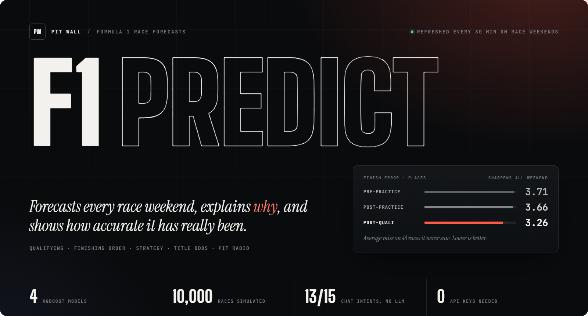
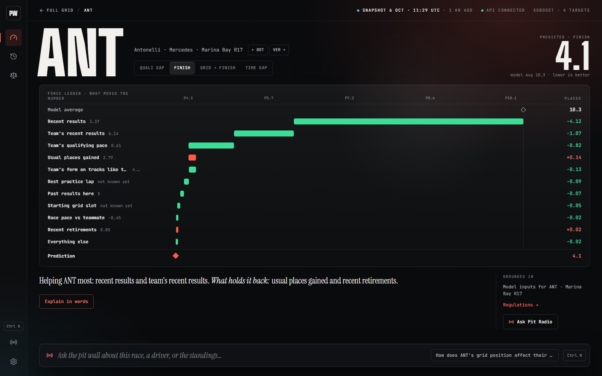
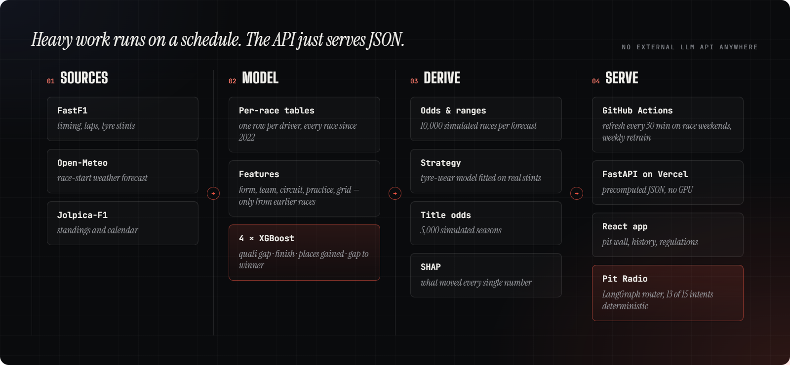
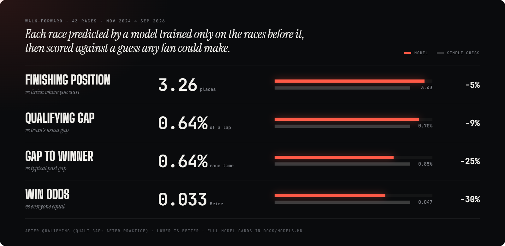

<p align="center">
  
</p>

<p align="center">
  
  
  
  
  
  
</p>

<p align="center">
  <a href="#what-it-does"><b>What it does</b></a> &nbsp;·&nbsp;
  <a href="#how-it-works"><b>How it works</b></a> &nbsp;·&nbsp;
  <a href="#accuracy"><b>Accuracy</b></a> &nbsp;·&nbsp;
  <a href="#run-it-locally"><b>Run it</b></a> &nbsp;·&nbsp;
  <a href="#deploying"><b>Deploy</b></a> &nbsp;·&nbsp;
  <a href="#api"><b>API</b></a> &nbsp;·&nbsp;
  <a href="#documentation"><b>Docs</b></a>
</p>

<br>

> *Most prediction content states a number with no reasoning. F1 Predict's "why" comes from the same model that made the prediction — every number traceable to real feature contributions and real FIA regulations, not vibes.*

<br>

<a id="what-it-does"></a>


For the next race, and for every race since 2022:

| | Question | What you see |
|---|---|---|
| `01` | **Who takes pole?** | Predicted qualifying order and lap times, with each driver's chance of pole, of reaching Q3, and of going out in Q1 |
| `02` | **Who wins?** | Predicted finishing order; chances to win, podium and score; a likely finishing range, retirement risk, and gap to the winner |
| `03` | **Why?** | The inputs that pushed each prediction up or down — recent results, grid slot, practice pace, circuit, weather forecast — in plain words, plus a written explanation |
| `04` | **Best strategy?** | The fastest tyre plans, pit windows, and what a safety car on a given lap changes |
| `05` | **Who wins the title?** | Live standings with each driver's and team's chance of the championship |
| `06` | **Anything else?** | Pit Radio — an analyst chat that answers from the app's own numbers and cites the FIA rules it uses |
| `07` | **Can I trust it?** | For every past race: what it predicted beforehand next to what happened, and its error against simple guesses |

Forecasts refresh automatically through the weekend, sharpening after every practice session and again after qualifying. On sprint weekends they also update after Sprint Qualifying and after the Sprint, and on race morning once the FIA publishes the official grid with penalties. There's no *"not available yet"* — only *"less informed yet."*

<p align="center">
  
  <br>
  <sub><i>A driver's Why page: every prediction is one click from what moved it.</i></sub>
</p>

<br>

<a id="how-it-works"></a>




1. **Data** — One row per driver per race since 2022: grid, qualifying and practice times, the race-start weather forecast, result, gap to the winner, plus lap-by-lap tyre stints.
2. **Features** — Recent form, circuit history, team form and pace, the teammate comparison and circuit characteristics. Every one is computed only from earlier races, so nothing leaks from the future.
3. **Four models, one per question** — XGBoost for qualifying gap, finishing position, places gained and gap to the winner. Each serves every weekend stage: trained on copies of past races with the not-yet-known information hidden.
4. **Derived outputs** — Odds and ranges from 10,000 simulated races around the model's order. Lap times and race length from circuit history. Strategy from a tyre-wear model fitted on real stints.
5. **Explanations** — SHAP values show how much each input moved each prediction.

<details>
<summary><b>Why the chat is deterministic-first</b></summary>
<br>

A LangGraph router matches a question to one of **15 intents** by keyword. **13 of them are pure data lookups** rendered from the real result — no LLM chooses a tool or computes a number, so there's nothing for a model to get wrong.

Only two — *"why is this predicted?"* and anything unmatched — hand the already-computed numbers to a local, LoRA-fine-tuned **Llama 3.2 1B** to turn into prose. The *"why"* answer cites the regulation articles it grounds on; an open-ended answer that mentions any number or name it wasn't given is replaced with a plain data answer before you see it.

A 1B model fine-tuned on a consumer GPU can write a good paragraph around numbers it's handed, but can't be trusted to choose which numbers to fetch or to compute them. See [docs/MODELS.md](docs/MODELS.md).

</details>

<br>

<a id="accuracy"></a>




Measured on the latest **43 races** (Nov 2024 → Sep 2026), each predicted by a model trained only on earlier races — exactly the way a live forecast is. The window includes the 2026 rule reset, the hardest period to predict.

| Prediction | Model | Simple guess |
|---|---|---|
| Finishing position *(after quali)* | **3.26** places | 3.43 · finish where you start |
| Qualifying gap *(after practice)* | **0.64%** of a lap · ~0.6 s | 0.70% · team's usual gap |
| Gap to winner | **0.64%** of race time · ~35 s | 0.85% · typical past gap |
| Win odds *(Brier)* | **0.033** | 0.047 · everyone equal |

The weekly retrain refuses to ship a model that doesn't beat its baseline. Full model cards — including where the models are weak — live in [docs/MODELS.md](docs/MODELS.md).

<br>

<a id="run-it-locally"></a>


Requires **Python 3.12+** and **Node 24**.

```bash
python -m venv .venv
.venv/Scripts/pip install -r requirements-dev.txt     # macOS/Linux: .venv/bin/pip
.venv/Scripts/python -m uvicorn src.api.main:app --reload

cd frontend && npm ci && npm run dev                  # → http://localhost:5173
```

That's it — no API key anywhere, and every chat intent except *"why is this predicted?"* and open-ended questions already works.

<details>
<summary><b>Optional — written prose from the local model</b></summary>
<br>

Needs an NVIDIA GPU; 4-bit inference fits in ~4 GB VRAM.

```bash
.venv/Scripts/pip install -r requirements-llm.txt
```

No wiring needed — the backend detects it automatically (`src/rag/llm.py` → `is_available()`).

</details>

<details>
<summary><b>Pipeline commands</b></summary>
<br>

| Task | Command |
|---|---|
| Forecast the next race now | `python -m src.models.refresh_job` |
| Ingest newly finished races | `python -m src.data.ingest --seasons 2026` |
| Race-weekend refresh + Monday ingest from a home connection (F1 live timing refuses GitHub's runners) | `scripts/refresh_local.ps1 -Python <python.exe>` · `-Ingest` · `-Register` installs both as scheduled tasks |
| Rebuild the feature table | `python -m src.features.build_dataset` |
| Retrain and evaluate all four models | `python -m src.models.train` *(~10 min)* |
| Refit blends, odds, history view, strategy | `python -m src.models.blend` · `python -m src.models.probabilities` · `python -m src.models.backtest_export` · `python -m src.strategy.model` |
| Car upgrades from the FIA's documents | `python -m src.data.fia --seasons 2026` |
| Rebuild the regulations index | `python -m src.rag.corpus` |
| Chat in the terminal | `python -m src.agent.cli` |
| Tests | `python -m src.features.build_dataset` once, then `pytest` · `npm run lint && npm run build` in `frontend/` |

</details>

<br>

<a id="deploying"></a>


The API needs no model, no API key and no GPU to serve 13 of 15 chat intents plus every other route. The other two degrade to a plain data answer — never an error.

**▸ Static + serverless (Vercel)** — One project serves the app and the API: the frontend builds to static files, `api/index.py` runs FastAPI as a Python function. Import the repo, keep the root as the repo root, deploy. No environment variables required. The API imports no pandas, XGBoost or torch — everything heavy is precomputed — so the function stays around 180 MB (cap: 250 MB) with short cold starts. Scheduled GitHub Actions commit fresh forecasts, and each commit redeploys; to serve new forecasts without redeploying, point `PREDICTIONS_DATA_SOURCE` at the raw GitHub URL of `data/predictions` (see `.env.example`).

**▸ Self-hosted, with the local model** — For written prose on *"why"* and open-ended questions, run the backend on any machine with an NVIDIA GPU and `requirements-llm.txt` installed. No separate inference service: the same FastAPI process serves everything, and the model loads on first use.

<br>

<a id="api"></a>


| Route | Returns |
|---|---|
| `GET /predictions/latest` · `/predictions/{season}/{round}` | The forecast with odds, ranges, qualifying odds and lap times |
| `GET /predictions/{season}/{round}/explain?driver=&target=` | The SHAP breakdown behind one prediction |
| `GET /predictions/{season}/{round}/timeline` | How the forecast moved through the weekend |
| `GET /strategy/{season}/{round}?sc_lap=` | Tyre strategies, pit windows, safety-car scenario |
| `GET /championship` | Standings with simulated title odds |
| `GET /backtest/races` · `/backtest/{season}/{round}` · `/backtest/summary` | Past races, predicted vs actual, accuracy by season |
| `GET /model` | Held-out accuracy of each model |
| `GET /races?season=` | The calendar |
| `GET /regulations` · `/regulations/search?query=` · `/regulations/{file}` | FIA regulations and steward decisions |
| `POST /explain` | A written explanation of one prediction *(local model; 503 if absent)* |
| `POST /chat` | Pit Radio, streamed as server-sent events — deterministic for 13 of 15 intents |

<br>

<a id="documentation"></a>


| Document | What's in it |
|---|---|
| [docs/MODELS.md](docs/MODELS.md) | Model cards — targets, inputs, accuracy, limits |
| [frontend/DESIGN.md](frontend/DESIGN.md) | The visual design system |

<br>

<p align="center">
  
</p>
